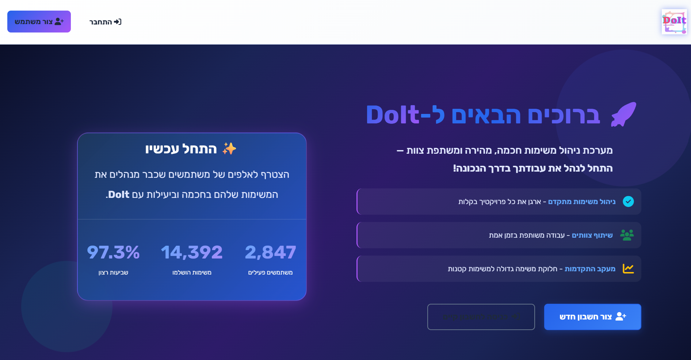
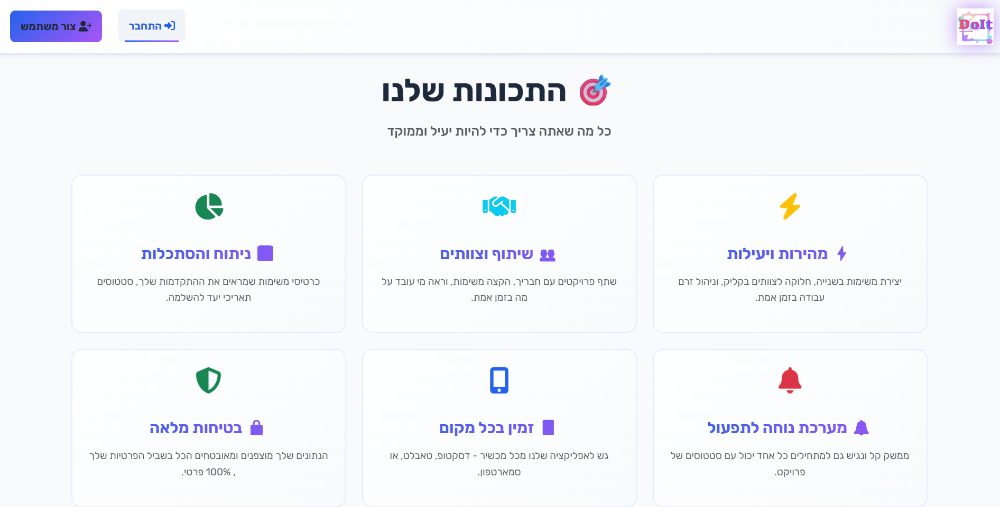
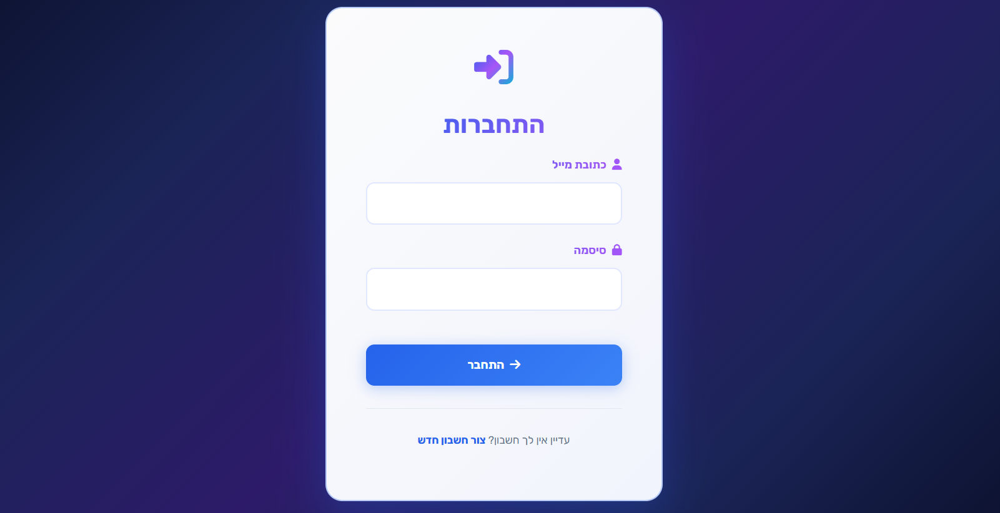
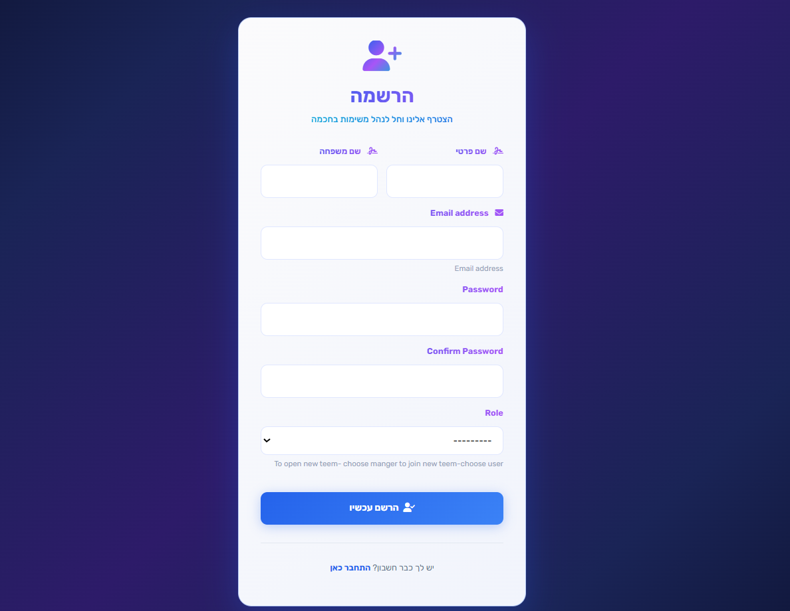
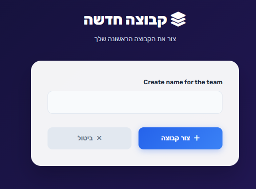
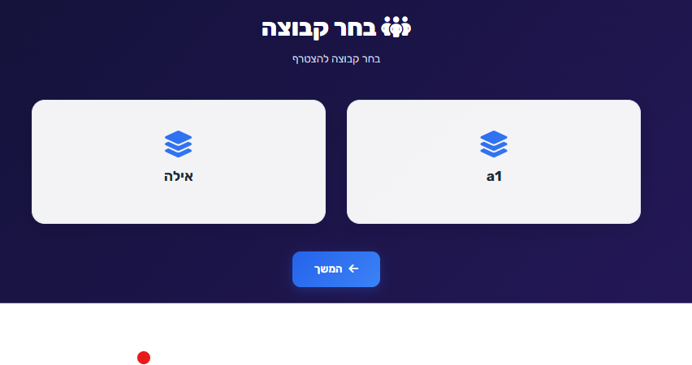
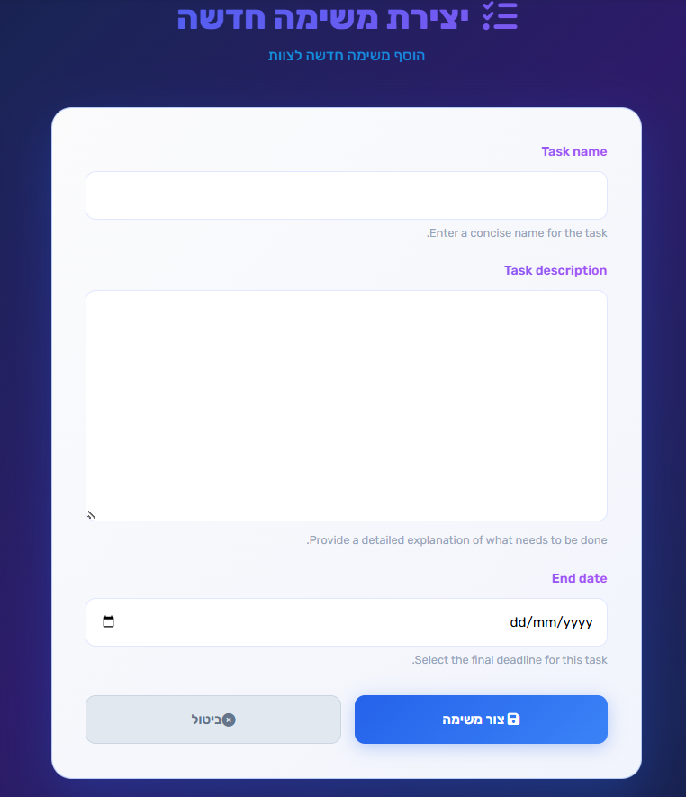
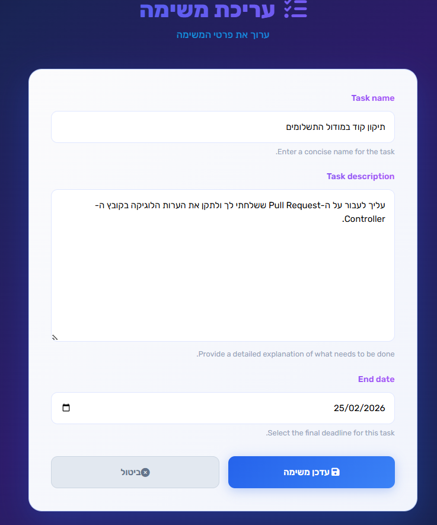
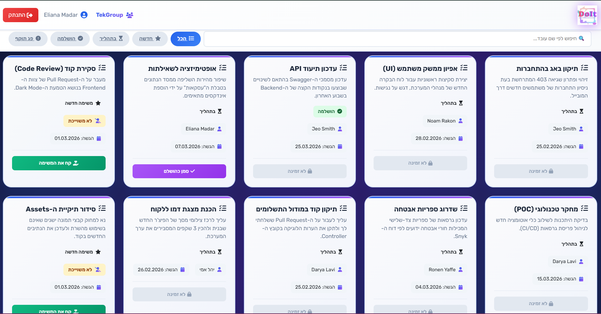

## ארכיטקטורת נתונים (Models)

המערכת בנויה על בסיס קשרים לוגיים המבטיחים הפרדה בין צוותים וניהול הרשאות מדויק. להלן פירוט המודלים העיקריים:

### 1. מודל משתמש (User Profile)
הרחבה של מודל המשתמש הסטנדרטי של Django לצורך ניהול תפקידים ושיוך ארגוני.
* **Role:** שדה בחירה (Manager/Employee).
* **Team:** מפתח זר (ForeignKey) המשייך כל משתמש לצוות ספציפי בלבד.

### 2. מודל צוות (Team)
יחידה לוגית המפרידה בין קבוצות עבודה.
* **Name:** שם הצוות (ייחודי).
* **Description:** תיאור כללי של מחלקת הצוות.

### 3. מודל משימה (Task)
הישות המרכזית במערכת, המנהלת את מחזור החיים של המשימה.
* **Title:** שם המשימה.
* **Description:** פירוט המשימה.
* **Due Date:** תאריך יעד לסיום.
* **Status:** בחירה בין (New / In Progress / Completed).
* **Assigned To:** מפתח זר למשתמש (ניתן לריקון - Nullable).
* **Team:** שיוך המשימה לצוות (נקבע אוטומטית לפי יוצר המשימה).

---

## תצוגת מסכי המערכת

### דף הבית ותהליך הכניסה
| דף הבית - חלק א' | דף הבית - חלק ב' | דף כניסה |
| :--- | :--- | :--- |
|  |  |  |

### תהליך רישום והצטרפות
| שלב א' - רישום | שלב ב' - רישום מנהל | שלב ב' - רישום עובד |
| :--- | :--- | :--- |
|  |  |  |

### ממשק ניהול משימות (Manager)
| הוספת משימה | עריכת משימה | צפייה במשימות מנהל |
| :--- | :--- | :--- |
|  |  |  |

### ממשק עובד (Employee)
| צפייה וסינון משימות |
| :--- |
|  |

## טכנולוגיות בשימוש
* **Backend:** Python & Django Framework.
* **Database:** Relational Database (SQLite/PostgreSQL).
* **Frontend:** Django Templates with Vanilla CSS.
* **Version Control:** Git & GitHub.